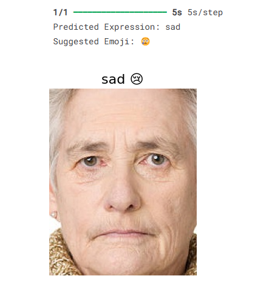

# Facial Expression Recognition using EfficientNetB0

This project implements a facial expression recognition system using a custom dataset and a convolutional neural network built on **EfficientNetB0** (without ImageNet weights). It identifies facial expressions across 9 classes and is designed for integration with real-time webcam applications such as emoji suggestion systems.

---

## 📁 Dataset

The dataset used is organized into folders where each subfolder represents a different facial expression class:


Images are loaded and processed directly using OpenCV.

---

## 🧪 Key Features

- Loads images directly from subfolders without resizing initially
- Converts BGR to RGB using OpenCV
- Applies preprocessing: resizing to 224x224, normalization
- Encodes labels using `LabelEncoder` and `to_categorical`
- Splits data into training and validation sets
- Trains an EfficientNetB0 model from scratch (no pre-trained ImageNet weights)
- Evaluates model with accuracy, loss graphs, classification report, and confusion matrix
- Visualizes class distribution and sample predictions

---

## 🛠️ Dependencies

Make sure you have the following libraries installed:

```bash
pip install tensorflow opencv-python pandas numpy scikit-learn matplotlib seaborn
🧾 How It Works
Data Loading

Images are loaded from fane_data/ and converted to RGB format

Labels are extracted from folder names

Total no of images 


Image Classes


Distribution of images 

Preprocessing

Resize to 224x224

Normalize to [0, 1] range

One-hot encode labels

Model Architecture

EfficientNetB0 as base (no ImageNet weights)

GlobalAveragePooling, Dropout, Dense layers

Final output layer with softmax (9 classes)

Training


Optimizer: Adam

Loss: categorical_crossentropy

Metrics: accuracy

Evaluation


🔍 Example Output
Replace these with actual images from your notebook

🧠 Sample predictions
ining


🔮 Model Performance
Achieved high accuracy across most facial expressions

Best performance on “happy”, “neutral”, and “angry”

Minor confusion between “sad” and “fear” or “disgust”

🚀 Future Work
Add webcam integration using OpenCV

Real-time emoji suggestion system

React + Flask based web deployment


📌 Author
Anand Raj


